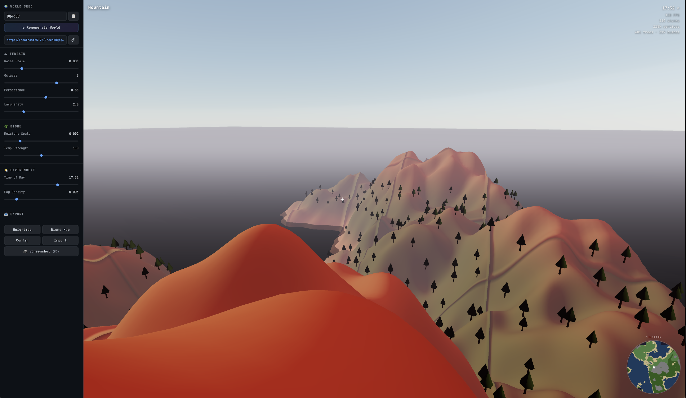

# WorldGen — Procedural Infinite Terrain with Neural Biome Classification

A real-time procedural infinite world generator running entirely in the browser. Terrain is generated chunk-by-chunk using layered simplex noise, with biome classification powered by a neural network trained at startup.

**[Live Demo →](#)** *(GitHub Pages link placeholder)*



---

## Features

- **Infinite terrain** — chunks stream in as you fly, unloading behind you
- **Neural biome classification** — a 3-layer MLP predicts biome type per-vertex for smooth transitions
- **6 biomes** — Ocean, Beach, Plains, Forest, Mountain, Snow with soft blending
- **Dynamic sky** — time-of-day slider with realistic sun position, stars at night
- **Water plane** — animated waves with specular highlights
- **Custom shaders** — height-based fog, directional lighting, ambient occlusion
- **LOD system** — distant chunks use lower resolution (64→32→16 vertices)
- **Zero backend** — fully client-side, deployable to GitHub Pages

---

## Why a Neural Network for Biome Classification?

The standard approach to procedural biomes uses hardcoded noise thresholds:

```
if (height < 0) → ocean
else if (height < 5 && moisture > 0.7) → swamp
...
```

This produces harsh, artificial transitions and requires extensive hand-tuning whenever noise parameters change.

**Our approach trains a small neural network on procedurally labeled data at startup.** The network learns the decision boundary from 2000 labeled samples, then applies softmax classification per-vertex. This produces:

1. **Smoother transitions** — softmax outputs blend biome colors by probability, yielding natural gradients between biomes rather than hard edges
2. **Generalization** — when users adjust noise scale, octaves, or moisture parameters, the network still produces coherent biomes (whereas threshold-based systems break down)
3. **Compact representation** — the entire biome logic is a 5→32→16→6 MLP (~700 weights) instead of dozens of handcrafted conditional branches

The network is implemented as a hand-written MLP with backpropagation in pure JavaScript (no framework dependencies). Training takes <500ms on page load and inference runs in microseconds per vertex.

---

## Biome Network Architecture

```
Input (5 features)          Output (6 biome probabilities)
┌─────────────┐             ┌─────────────┐
│  height     │             │  ocean      │
│  moisture   │  ┌──────┐   │  beach      │
│  temperature├─►│Dense │   │  plains     │
│  slope      │  │32    ├─►│Dense ├─►│  forest     │
│  dist_water │  │ ReLU │   │16    │   │  mountain   │
└─────────────┘  └──────┘   │ ReLU │   │  snow       │
                             └──────┘   └─────────────┘
                                         (softmax)
```

**Input features per vertex:**
| Feature | Source |
|---------|--------|
| `height` | Normalized simplex noise height (-1 to 1) |
| `moisture` | Independent 4-octave noise field (0 to 1) |
| `temperature` | Height-correlated noise + latitude gradient (0 to 1) |
| `slope` | Finite difference of heightmap, normalized (0 to 1) |
| `dist_water` | Distance from water level (0 for underwater vertices) |

**Training data:** 2000 samples labeled by procedural rules, generated from random world positions. The network learns to reproduce these rules but with smooth probabilistic boundaries.

**Implementation:** Pure JavaScript MLP with:
- He initialization for weight matrices
- Mini-batch SGD with backpropagation
- Cross-entropy loss with softmax output
- 20 training epochs, batch size 64

---

## Project Structure

```
src/
  main.js                # Entry point, scene setup, render loop
  terrain/
    ChunkManager.js      # Chunk loading/unloading, LOD
    ChunkMesh.js         # Geometry generation, vertex colors
    NoiseGenerator.js    # Simplex noise, octave layering
  biome/
    BiomeNetwork.js      # MLP definition, training, inference
    BiomeLabeler.js      # Procedural label generation for training
  rendering/
    shaders/
      terrain.vert       # Vertex shader (lighting, fog)
      terrain.frag       # Fragment shader
      water.vert         # Water vertex shader (waves)
      water.frag         # Water fragment shader
    Sky.js               # THREE.Sky wrapper + stars
    Water.js             # Animated water plane
  ui/
    HUD.js               # Biome label, FPS, stats
    ControlPanel.js      # Sliders, regenerate button
index.html
vite.config.js
package.json
```

---

## How to Run Locally

```bash
# Clone the repository
git clone https://github.com/your-username/worldgen.git
cd worldgen

# Install dependencies
npm install

# Start development server
npm run dev
```

Open http://localhost:5173 in your browser.

### Controls

| Key | Action |
|-----|--------|
| **WASD** | Move forward/left/back/right |
| **Mouse** | Look around (click canvas first) |
| **Shift** | Sprint (3x speed) |
| **Space** | Fly up |
| **Q** | Fly down |

### Build for Production

```bash
npm run build
# Output in dist/ — deploy to GitHub Pages, Netlify, etc.
```

---

## Performance

- **Target:** 60 FPS on mid-range laptop
- **Max vertices in scene:** ~500k (LOD + chunk radius limits)
- **Chunk generation:** ~5-10ms per chunk (batched MLP inference)
- **Biome training:** <500ms on page load (20 epochs, 2000 samples)

---

## Tech Stack

- [Three.js](https://threejs.org/) — 3D rendering
- [simplex-noise](https://github.com/jwagner/simplex-noise.js) — heightmap generation
- [Vite](https://vitejs.dev/) — build tooling
- Pure JavaScript MLP — biome neural network (no framework dependencies)
